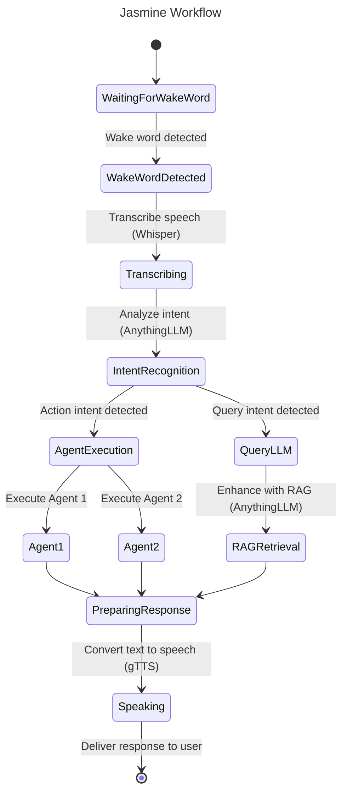

# Jasmine - Multi-Lingual, Voice AI Assistant with RAG, Agentic Features and 100% Local

Jasmine is my voice AI assistant designed to provide intelligent, multi-lingual, and knowledge-aware assistance. Unlike cloud-based AI assistants (Alexa, Siri...), Jasmine operates entirely locally, ensuring privacy and data security while delivering a seamless conversational experience.

## Demos

### Via Voice
[](https://www.youtube.com/watch?v=_8_nw5RYdug)

### Via Console
[](https://www.youtube.com/watch?v=HWdabFkBePQ)

## Key Features

### Multi-Lingual Support  
Jasmine understands and responds in multiple languages, enabling smooth interactions across diverse linguistic needs.

### Voice AI and Wakeup Word Capabilities  
Jasmine is built with advanced voice recognition and synthesis with wakeup capability, offering a natural and human-like conversational experience.

### RAG (Retrieval-Augmented Generation)  
By leveraging RAG, Jasmine enhances responses with real-time, contextually relevant information retrieved from local knowledge sources.

### Agentic AI with LangGraph 
Jasmine operates as an autonomous agent, capable of decision-making, task execution, and proactive assistance based on user preferences and historical interactions.

### 100% Local Execution  
Unlike cloud-based assistants, Jasmine runs entirely on local hardware, ensuring complete control over data, privacy, and security.

## Audiences
For innovators who is willing to spend time in creating the next generation voice capable AI assistants. Minimum Python and AI knowledges are required. However, you should have prerequisite knowledges of the tools discussed below.

## How Jasmine Works  
1. **Speech Recognition** - Captures and transcribes voice input with high accuracy.
2. **Context-Aware Processing** - Uses AI-driven understanding to analyze queries.
3. **Knowledge Retrieval (RAG)** - Enhances responses by pulling relevant information from local sources.
4. **Intent Detection** - Detect and execute commands from speech.
5. **Conversational AI** - Generates accurate, contextually aware replies.
6. **Voice Synthesis** - Responds with natural-sounding speech output.

### Diagram


### Disclaimer
Althought I want to provide as much instructions as possible, some requires too much time to cover. I highly recommend you get yourself familiar with the tools used before going further.

### Prerequisites

Jasmine requires two key components: **LM Studio** and **AnythingLLM**. These tools provide the AI model foundation and enable retrieval-augmented generation (RAG) for enhanced responses. Follow the official setup guides for each tool before proceeding.

#### LM Studio

LM Studio acts as the **AI model provider** for Jasmine, allowing you to download and manage models of your choice. It also serves as the **agent AI server** that processes and responds to queries.

- Install **LM Studio** following the [official setup guide](https://lmstudio.ai).  
- Download and configure an **LLM model** that matches your hardware capacity.  
- Ensure the **API server** is running. The default URL is:  
  ```
  http://localhost:1234/v1
  ```
- LM Studio must remain active while using Jasmine.

#### AnythingLLM

AnythingLLM provides the **interface for managing LLM workspaces** and enables **RAG-powered AI** by allowing queries to access stored knowledge. It acts as the middleware between Jasmine and LM Studio.

- Install **AnythingLLM** following the [official manual](https://anythingllm.com).
- Configure **LM Studio** as the backend for AnythingLLM to handle LLM queries.
- Also download an embedding model (relatively small) for RAG.
- Make sure the total model parameter size don't exceed the capability of your hardware.
- The default API URL is:  
  ```
  http://localhost:3001/api
  ```
- Obtain an **API key** from the AnythingLLM console.

#### Configuring Workspaces

Jasmine requires **two workspaces** in AnythingLLM to function effectively:

##### `Chat` Workspace
- Used for **LLM queries** (e.g., answering questions, conversations).
- Can be configured with **any model** that your hardware supports.
- Larger models provide better responses but require more resources.
- Upload supported documents to this workspace for knowledge base data.

##### `Intent` Workspace
- Handles **intent classification queries** (e.g., identifying the agent to run).
- A **smaller model (around 3B parameters)** is sufficient.

*Note: workspace names are configurable in the .env file illustrated below.*

#### Wakeup Word

You can choose a wake-up word in any language that suits your preference. 

Jasmine utilizes **Picovoice Porcupine** for wake-word detection. To set up a custom wakeup word, follow these steps:

1. Sign up for a free account at [Picovoice](https://picovoice.ai/).  
2. Navigate to the Porcupine Console and create a new wake word model.  
3. Download the trained wake word model in `.ppn` format.  
4. Save the file to a directory in your project, for example: `wakewords/jasmine.ppn`.
5. You can have multiple wakeup words, however they have to be in the same language.
6. For security reason, you have to get an API key and your own wakeup word model from Picovoice.
7. Internet connection is not required for wakeup word to function.

#### Whisper STT (Speech-to-Text)
Jasmine utilizes **OpenAI's Whisper** library to transcribe spoken audio into text. Whisper supports multiple languages and offers various model sizes to balance between speed and accuracy.

- **GitHub Repository:** [https://github.com/openai/whisper](https://github.com/openai/whisper)  

##### Available Models:
1. **Tiny** – The smallest model, fastest but least accurate.  
2. **Base** – Default model with **74 million parameters**, offering a good balance between speed and accuracy.  
3. **Small** – A multilingual model with **244 million parameters**, offering improved accuracy.  
4. **Medium** – A more accurate multilingual model with **769 million parameters**.  
5. **Large** – The most accurate multilingual model with **1550 million parameters**, but also the slowest and most resource-intensive.

#### gTTS (Text-to-Speech)

For converting text responses into spoken audio, Jasmine uses the **Google Text-to-Speech (gTTS)** library. While gTTS isn't the most advanced TTS engine available, it provides a simple and fast solution for Jasmine’s needs.

- **GitHub Repository:** [https://github.com/pndurette/gTTS](https://github.com/pndurette/gTTS)  

#### Installation

Use **Conda** or any other Python virtual environment tool to simplify the dependency handling and environment isolation.

1. **Create a Conda Environment:**  
   Create a new Conda environment named `jasmine` with Python 3.12.

   ```bash
   conda create -n jasmine python=3.12
   ```

2. **Activate the Environment:**  
   After creating the environment, activate it:

   ```bash
   conda activate jasmine
   ```

3. **Run the `install.sh` Script:**  
   Jasmine includes an `install.sh` script to automatically install all required dependencies.

   ```bash
   ./install.sh
   ```

4. **Deactivate the Environment:**

  To exit the `jasmine` environment when you're done:

  ```bash
  conda deactivate
  ```

  Or if you want to remove the environment later:

  ```bash
  conda remove --name jasmine --all
  ```

Additionally, you might have to install the following package for your OS:

  For Mac:
  ```bash
  brew install ffmpeg
  ```

#### .env Configurations

Go over the following configuration and modify to fit your need.

```
AI_ASSISTANT_NAME="Jasmine"
AI_ASSISTANT_PROMPT="You are Jasmine, an intelligent voice assistant designed to help Alan. Your responses are concise and precise with one sentence. Providing clear and accurate information without unnecessary verbosity. You don't use greeting words or phrases."

# Intent Classification Prompt
INTENT_CLASSIFICATION_PROMPT="Classify the following intent into one of the following categories:
- \"llm\" for normal chatbot requests.
- \"summarization\" if it asks to summarize a webpage.
- \"turn_on_lights\" if it asks to turn on the lights.
- \"turn_off_lights\" if it asks to turn off the lights.
- \"other\" if it's unclear.

Intent: {command}

Output only one of: llm, summarization, turn_on_lights, turn_off_lights, other."

# AnythingLLM Configurations
ANYTHING_LLM_API_URL="http://localhost:3001/api"
ANYTHING_LLM_API_KEY="[CHANGE_ME]"
ANYTHING_LLM_CHAT_WORKSPACE="chat"
ANYTHING_LLM_CHAT_TEMPERATURE=0.0
ANYTHING_LLM_INTENT_WORKSPACE="intent"
ANYTHING_LLM_INTENT_TEMPERATURE=0.0

# Agent Configurations
AGENT_API_URL="http://localhost:1234/v1"
AGENT_MODEL="granite-3.1-8b-instruct"

# PicoVoice Configurations
PORCUPINE_ACCESS_KEY="[CHANGE_ME]"
PORCUPINE_WAKE_WORD="wakewords/jasmine.ppn"

# Whisper STT Configurations
WHISPER_MODEL="medium"

# Language Configurations
FIRST_LANGUAGE_NAME="English"
FIRST_LANGUAGE_CODE="en"
SECOND_LANGUAGE_NAME="Chinese"
SECOND_LANGUAGE_CODE="zh"
SECOND_LANGUAGE_SPOKEN_CODE="zh-cn"

# Debug Configurations
DEBUG_AI_RESPONSE=false
```

#### Agentic Code Setup
AnythingLLM has agent capability built-in already, however it's still envolving. I chose **LangGraph** as the agent orchestrator for maximum flexibility.

Jasmine includes two agentic demos to showcase its ability to execute tasks beyond simple conversational queries. These agents handle web site content `summarization` and mocked `light control`. You can expand Jasmine’s functionality by adding more agents to automate various tasks.

#### Run Jasmine

Plug in your microphone and run `python jasmine.py`. If you prefer to run it via the console, run `python console.py`.

*Note: The first time you run Jasmine, it may take longer as the Whisper model needs to be downloaded.*

## What's Next?
- There are still a lot of improvements to be made.
- I'll make a cloud version with AWS BedRock.
- I'll accept PRs with performance improvements.

